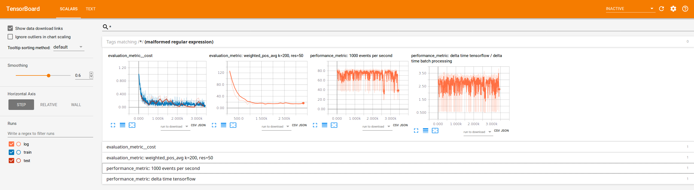

#POC recommender
Proof of concept (POC) of a recommender of time series categorical data.
We use Tensorboard and nmslib for visualization and nearest neighbor queries, respectively.

The virtual conda environment can be setup via the included setup.sh script.

Pull-requests are welcome.

## prior data preparation
Prepare data with integer numbers as in test/train_data_small which is used as input.
Each line is one unser interaction history ordered w.r.t. time.

## overview
Naming convention:
* interaction: one single integer in the history given in the data
* event: one event contains features and targets beside having an occurence count.

We use the data to generate events. 
The events are sparse one-hot encoded according to the integer given in the data file.
Thus, make sure, the user interactions are mapped to unique sequential integer values! 
For the translation, we use a mapping, defined in the interaction_map file for easier interpretation.

## profiling
Some performance metrics are plotted with Tensorboard.

The (final) json file produced can be viewed via a chrome browser:
    chrome://tracing

# REST API (WIP)

## starting
use gunicorn in virtual environment (see environment.yml)

Start server (set timeout to let it create the index):
    gunicorn things:app --timeout=1500
    
## profiling
install:
    sudo apt install apache2-utils
    
profile via, e.g.:
    ab -c 10 -n 100000 http://127.0.0.1:8000/recos?url=aa