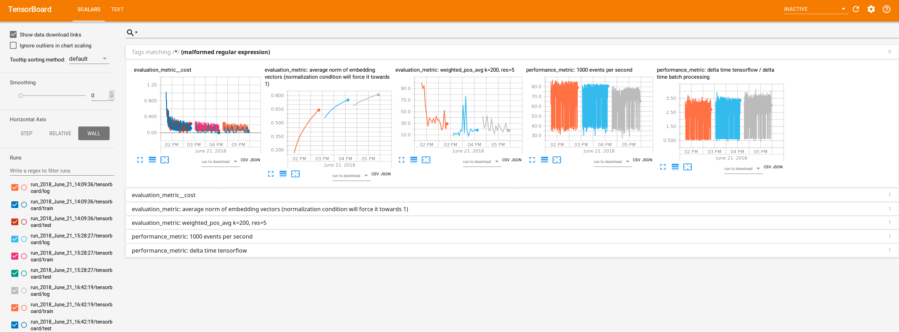

Proof of concept (POC) of a recommender of time series categorical data.
We use Tensorboard and nmslib for visualization and nearest neighbor queries, respectively.

The virtual conda environment can be setup via the included setup.sh script.

What is under the hood beside python standard libraries such as pandas, scipy, ...:
* nmslib: https://github.com/nmslib/nmslib
* tensorflow: https://github.com/tensorflow/tensorflow
* falcon: https://github.com/falconry/falcon
* gunicorn: https://github.com/benoitc/gunicorn

Pull-requests are welcome.

# training and testing
## prior data preparation
Prepare data with integer numbers as in test/train_data_small which is used as input.
Each line is one unser interaction history ordered w.r.t. time (see attached data), e.g.:

```bash
_,0
a,1
b,2
c,3
d,4
e,5
f,6
...
```

A map to string is needed (see attached data), e.g.:

```bash
15,8,34,15,76,77,78,38,76,79,40,76,8,50
15,15,92,15,92,15,92,15,92
15,35,38,37,39,36,40,41,35,15,35,37,39,36,38,40,41,35
29,30
68,68,15
15,6,15,6,3,4,5,15,6,15,6,15
... 
```

## overview
Naming convention:
* interaction: one single integer in the history given in the data
* event: one event contains features and targets beside having an occurence count.

We use the data to generate events. 
The events are sparse one-hot encoded according to the integer given in the data file.
Thus, make sure, the user interactions are mapped to unique sequential integer values! 
For the translation, we use a mapping, defined in the interaction_map file for easier interpretation.


## profiling and evaluation
Some performance metrics are plotted with Tensorboard.
Below, the three subsequent runs can be seen, each time adding new data and new cathegories up to 1 million.
The metrics include TODO: explain metrics. 



The (final) json file produced can be viewed via a chrome browser:
    chrome://tracing


# rest-api falcon
The reco rest api for a single recommender (conditional) index 
is shown as example:

The metrics endpoint is shown in the profiling section below.

## starting
We use gunicorn in the virtual environment (see environment.yml)
to start the server.
Start server (set timeout to let it create the index):
```bash
    gunicorn recos:app --timeout=1500
```    
## profiling
install:
```bash
    sudo apt install apache2-utils
```    
profile via, e.g.:
```bash
    ab -c 10 -n 100000 http://127.0.0.1:8000/recos?url=aa
```    
    
Profiling output of the rest-api calls on an i7 local machine for ca. 
600 thousand items with a vector size of 100:
```bash
Percentage of the requests served within a certain time (ms)
  50%      7
  66%      7
  75%      7
  80%      7
  90%      7
  95%      8
  98%      8
  99%      8
 100%     26 (longest request)
```
The internal nmslib call was (shown in the metrics endpoint):


Carl says that's ok.